```mermaid
flowchart TB
    subgraph current["EF.Core.Utilities.Test.Web.csproj"]
        MAIN["<b>📦&nbsp;EF.Core.Utilities.Test.Web.csproj</b><br/><small>net8.0</small>"]
        click MAIN "#efcoreutilitiestestwebefcoreutilitiestestwebcsproj"
    end
    subgraph downstream["Dependencies (1"]
        P3["<b>📦&nbsp;EF.Core.Utilities.csproj</b><br/><small>net8.0</small>"]
        click P3 "#efcoreutilitiesefcoreutilitiescsproj"
    end
    MAIN --> P3

```

```mermaid
flowchart TB
    subgraph current["EF.Core.Utilities.Test.csproj"]
        MAIN["<b>📦&nbsp;EF.Core.Utilities.Test.csproj</b><br/><small>net8.0</small>"]
        click MAIN "#efcoreutilitiestestefcoreutilitiestestcsproj"
    end
    subgraph downstream["Dependencies (1"]
        P3["<b>📦&nbsp;EF.Core.Utilities.csproj</b><br/><small>net8.0</small>"]
        click P3 "#efcoreutilitiesefcoreutilitiescsproj"
    end
    MAIN --> P3

```

```mermaid
flowchart TB
    subgraph upstream["Dependants (2)"]
        P1["<b>📦&nbsp;EF.Core.Utilities.Test.Web.csproj</b><br/><small>net8.0</small>"]
        P2["<b>📦&nbsp;EF.Core.Utilities.Test.csproj</b><br/><small>net8.0</small>"]
        click P1 "#efcoreutilitiestestwebefcoreutilitiestestwebcsproj"
        click P2 "#efcoreutilitiestestefcoreutilitiestestcsproj"
    end
    subgraph current["EF.Core.Utilities.csproj"]
        MAIN["<b>📦&nbsp;EF.Core.Utilities.csproj</b><br/><small>net8.0</small>"]
        click MAIN "#efcoreutilitiesefcoreutilitiescsproj"
    end
    P1 --> MAIN
    P2 --> MAIN

```

# Projects and dependencies analysis

This document provides a comprehensive overview of the projects and their dependencies in the context of upgrading to .NETCoreApp,Version=v9.0.

## Table of Contents

- [Executive Summary](#executive-Summary)
  - [Highlevel Metrics](#highlevel-metrics)
  - [Projects Compatibility](#projects-compatibility)
  - [Package Compatibility](#package-compatibility)
  - [API Compatibility](#api-compatibility)
- [Aggregate NuGet packages details](#aggregate-nuget-packages-details)
- [Top API Migration Challenges](#top-api-migration-challenges)
  - [Technologies and Features](#technologies-and-features)
  - [Most Frequent API Issues](#most-frequent-api-issues)
- [Projects Relationship Graph](#projects-relationship-graph)
- [Project Details](#project-details)

  - [EF.Core.Utilities.Test.Web\EF.Core.Utilities.Test.Web.csproj](#efcoreutilitiestestwebefcoreutilitiestestwebcsproj)
  - [EF.Core.Utilities.Test\EF.Core.Utilities.Test.csproj](#efcoreutilitiestestefcoreutilitiestestcsproj)
  - [EF.Core.Utilities\EF.Core.Utilities.csproj](#efcoreutilitiesefcoreutilitiescsproj)

## Executive Summary

### Highlevel Metrics

| Metric | Count | Status |
| :--- | :---: | :--- |
| Total Projects | 3 | All require upgrade |
| Total NuGet Packages | 17 | 9 need upgrade |
| Total Code Files | 36 |  |
| Total Code Files with Incidents | 5 |  |
| Total Lines of Code | 2237 |  |
| Total Number of Issues | 22 |  |
| Estimated LOC to modify | 8+ | at least 0.4% of codebase |

### Projects Compatibility

| Project | Target Framework | Difficulty | Package Issues | API Issues | Est. LOC Impact | Description |
| :--- | :---: | :---: | :---: | :---: | :---: | :--- |
| [EF.Core.Utilities.Test.Web\EF.Core.Utilities.Test.Web.csproj](#efcoreutilitiestestwebefcoreutilitiestestwebcsproj) | net8.0 | 🟢 Low | 7 | 8 | 8+ | AspNetCore, Sdk Style = True |
| [EF.Core.Utilities.Test\EF.Core.Utilities.Test.csproj](#efcoreutilitiestestefcoreutilitiestestcsproj) | net8.0 | 🟢 Low | 2 | 0 |  | DotNetCoreApp, Sdk Style = True |
| [EF.Core.Utilities\EF.Core.Utilities.csproj](#efcoreutilitiesefcoreutilitiescsproj) | net8.0 | 🟢 Low | 2 | 0 |  | ClassLibrary, Sdk Style = True |

### Package Compatibility

| Status | Count | Percentage |
| :--- | :---: | :---: |
| ✅ Compatible | 8 | 47.1% |
| ⚠️ Incompatible | 0 | 0.0% |
| 🔄 Upgrade Recommended | 9 | 52.9% |
| ***Total NuGet Packages*** | ***17*** | ***100%*** |

### API Compatibility

| Category | Count | Impact |
| :--- | :---: | :--- |
| 🔴 Binary Incompatible | 0 | High - Require code changes |
| 🟡 Source Incompatible | 8 | Medium - Needs re-compilation and potential conflicting API error fixing |
| 🔵 Behavioral change | 0 | Low - Behavioral changes that may require testing at runtime |
| ✅ Compatible | 4165 |  |
| ***Total APIs Analyzed*** | ***4173*** |  |

## Aggregate NuGet packages details

| Package | Current Version | Suggested Version | Projects | Description |
| :--- | :---: | :---: | :--- | :--- |
| coverlet.collector | 6.0.4 |  | [EF.Core.Utilities.Test.csproj](#efcoreutilitiestestefcoreutilitiestestcsproj) | ✅Compatible |
| CRFricke.Test.Support | 8.0.1 |  | [EF.Core.Utilities.Test.csproj](#efcoreutilitiestestefcoreutilitiestestcsproj) | ✅Compatible |
| Microsoft.AspNetCore.Diagnostics.EntityFrameworkCore | 8.0.14 | 9.0.12 | [EF.Core.Utilities.Test.Web.csproj](#efcoreutilitiestestwebefcoreutilitiestestwebcsproj) | NuGet package upgrade is recommended |
| Microsoft.AspNetCore.Identity.EntityFrameworkCore | 8.0.14 | 9.0.12 | [EF.Core.Utilities.csproj](#efcoreutilitiesefcoreutilitiescsproj) [EF.Core.Utilities.Test.Web.csproj](#efcoreutilitiestestwebefcoreutilitiestestwebcsproj) | NuGet package upgrade is recommended |
| Microsoft.AspNetCore.Identity.UI | 8.0.14 | 9.0.12 | [EF.Core.Utilities.Test.Web.csproj](#efcoreutilitiestestwebefcoreutilitiestestwebcsproj) | NuGet package upgrade is recommended |
| Microsoft.AspNetCore.Mvc.Razor.RuntimeCompilation | 8.0.14 | 9.0.12 | [EF.Core.Utilities.Test.Web.csproj](#efcoreutilitiestestwebefcoreutilitiestestwebcsproj) | NuGet package upgrade is recommended |
| Microsoft.EntityFrameworkCore.Sqlite | 8.0.14 | 9.0.12 | [EF.Core.Utilities.Test.csproj](#efcoreutilitiestestefcoreutilitiestestcsproj) [EF.Core.Utilities.Test.Web.csproj](#efcoreutilitiestestwebefcoreutilitiestestwebcsproj) | NuGet package upgrade is recommended |
| Microsoft.EntityFrameworkCore.SqlServer | 8.0.14 | 9.0.12 | [EF.Core.Utilities.Test.Web.csproj](#efcoreutilitiestestwebefcoreutilitiestestwebcsproj) | NuGet package upgrade is recommended |
| Microsoft.EntityFrameworkCore.Tools | 8.0.14 | 9.0.12 | [EF.Core.Utilities.Test.Web.csproj](#efcoreutilitiestestwebefcoreutilitiestestwebcsproj) | NuGet package upgrade is recommended |
| Microsoft.Extensions.DependencyInjection.Abstractions | 8.0.2 | 9.0.12 | [EF.Core.Utilities.Test.csproj](#efcoreutilitiestestefcoreutilitiestestcsproj) | NuGet package upgrade is recommended |
| Microsoft.Extensions.Diagnostics.Testing | 8.10.0 |  | [EF.Core.Utilities.Test.csproj](#efcoreutilitiestestefcoreutilitiestestcsproj) | ✅Compatible |
| Microsoft.Extensions.Hosting.Abstractions | 8.0.1 | 9.0.12 | [EF.Core.Utilities.csproj](#efcoreutilitiesefcoreutilitiescsproj) | NuGet package upgrade is recommended |
| Microsoft.NET.Test.Sdk | 17.13.0 |  | [EF.Core.Utilities.Test.csproj](#efcoreutilitiestestefcoreutilitiestestcsproj) | ✅Compatible |
| Microsoft.SourceLink.GitHub | 8.0.0 |  | [EF.Core.Utilities.csproj](#efcoreutilitiesefcoreutilitiescsproj) | ✅Compatible |
| Moq | 4.20.72 |  | [EF.Core.Utilities.Test.csproj](#efcoreutilitiestestefcoreutilitiestestcsproj) | ✅Compatible |
| xunit | 2.9.3 |  | [EF.Core.Utilities.Test.csproj](#efcoreutilitiestestefcoreutilitiestestcsproj) | ✅Compatible |
| xunit.runner.visualstudio | 3.0.2 |  | [EF.Core.Utilities.Test.csproj](#efcoreutilitiestestefcoreutilitiestestcsproj) | ✅Compatible |

## Top API Migration Challenges

### Technologies and Features

| Technology | Issues | Percentage | Migration Path |
| :--- | :---: | :---: | :--- |

### Most Frequent API Issues

| API | Count | Percentage | Category |
| :--- | :---: | :---: | :--- |
| T:Microsoft.Extensions.DependencyInjection.IdentityServiceCollectionUIExtensions | 1 | 12.5% | Source Incompatible |
| M:Microsoft.Extensions.DependencyInjection.IdentityServiceCollectionUIExtensions.AddDefaultIdentity''1(Microsoft.Extensions.DependencyInjection.IServiceCollection,System.Action{Microsoft.AspNetCore.Identity.IdentityOptions}) | 1 | 12.5% | Source Incompatible |
| T:Microsoft.Extensions.DependencyInjection.IdentityEntityFrameworkBuilderExtensions | 1 | 12.5% | Source Incompatible |
| M:Microsoft.Extensions.DependencyInjection.IdentityEntityFrameworkBuilderExtensions.AddEntityFrameworkStores''1(Microsoft.AspNetCore.Identity.IdentityBuilder) | 1 | 12.5% | Source Incompatible |
| T:Microsoft.AspNetCore.Builder.MigrationsEndPointExtensions | 1 | 12.5% | Source Incompatible |
| M:Microsoft.AspNetCore.Builder.MigrationsEndPointExtensions.UseMigrationsEndPoint(Microsoft.AspNetCore.Builder.IApplicationBuilder) | 1 | 12.5% | Source Incompatible |
| T:Microsoft.Extensions.DependencyInjection.DatabaseDeveloperPageExceptionFilterServiceExtensions | 1 | 12.5% | Source Incompatible |
| M:Microsoft.Extensions.DependencyInjection.DatabaseDeveloperPageExceptionFilterServiceExtensions.AddDatabaseDeveloperPageExceptionFilter(Microsoft.Extensions.DependencyInjection.IServiceCollection) | 1 | 12.5% | Source Incompatible |

## Projects Relationship Graph

Legend:
📦 SDK-style project
⚙️ Classic project

```mermaid
flowchart LR
    P1["<b>📦&nbsp;EF.Core.Utilities.Test.Web.csproj</b><br/><small>net8.0</small>"]
    P2["<b>📦&nbsp;EF.Core.Utilities.Test.csproj</b><br/><small>net8.0</small>"]
    P3["<b>📦&nbsp;EF.Core.Utilities.csproj</b><br/><small>net8.0</small>"]
    P1 --> P3
    P2 --> P3
    click P1 "#efcoreutilitiestestwebefcoreutilitiestestwebcsproj"
    click P2 "#efcoreutilitiestestefcoreutilitiestestcsproj"
    click P3 "#efcoreutilitiesefcoreutilitiescsproj"

```

## Project Details

### EF.Core.Utilities.Test.Web\EF.Core.Utilities.Test.Web.csproj

#### Project Info

- **Current Target Framework:** net8.0
- **Proposed Target Framework:** net9.0
- **SDK-style**: True
- **Project Kind:** AspNetCore
- **Dependencies**: 1
- **Dependants**: 0
- **Number of Files**: 33
- **Number of Files with Incidents**: 3
- **Lines of Code**: 1665
- **Estimated LOC to modify**: 8+ (at least 0.5% of the project)

#### Dependency Graph

Legend:
📦 SDK-style project
⚙️ Classic project

### API Compatibility

| Category | Count | Impact |
| :--- | :---: | :--- |
| 🔴 Binary Incompatible | 0 | High - Require code changes |
| 🟡 Source Incompatible | 8 | Medium - Needs re-compilation and potential conflicting API error fixing |
| 🔵 Behavioral change | 0 | Low - Behavioral changes that may require testing at runtime |
| ✅ Compatible | 3176 |  |
| ***Total APIs Analyzed*** | ***3184*** |  |

### EF.Core.Utilities.Test\EF.Core.Utilities.Test.csproj

#### Project Info

- **Current Target Framework:** net8.0
- **Proposed Target Framework:** net9.0
- **SDK-style**: True
- **Project Kind:** DotNetCoreApp
- **Dependencies**: 1
- **Dependants**: 0
- **Number of Files**: 3
- **Number of Files with Incidents**: 1
- **Lines of Code**: 278
- **Estimated LOC to modify**: 0+ (at least 0.0% of the project)

#### Dependency Graph

Legend:
📦 SDK-style project
⚙️ Classic project

### API Compatibility

| Category | Count | Impact |
| :--- | :---: | :--- |
| 🔴 Binary Incompatible | 0 | High - Require code changes |
| 🟡 Source Incompatible | 0 | Medium - Needs re-compilation and potential conflicting API error fixing |
| 🔵 Behavioral change | 0 | Low - Behavioral changes that may require testing at runtime |
| ✅ Compatible | 764 |  |
| ***Total APIs Analyzed*** | ***764*** |  |

### EF.Core.Utilities\EF.Core.Utilities.csproj

#### Project Info

- **Current Target Framework:** net8.0
- **Proposed Target Framework:** net9.0
- **SDK-style**: True
- **Project Kind:** ClassLibrary
- **Dependencies**: 0
- **Dependants**: 2
- **Number of Files**: 7
- **Number of Files with Incidents**: 1
- **Lines of Code**: 294
- **Estimated LOC to modify**: 0+ (at least 0.0% of the project)

#### Dependency Graph

Legend:
📦 SDK-style project
⚙️ Classic project

### API Compatibility

| Category | Count | Impact |
| :--- | :---: | :--- |
| 🔴 Binary Incompatible | 0 | High - Require code changes |
| 🟡 Source Incompatible | 0 | Medium - Needs re-compilation and potential conflicting API error fixing |
| 🔵 Behavioral change | 0 | Low - Behavioral changes that may require testing at runtime |
| ✅ Compatible | 225 |  |
| ***Total APIs Analyzed*** | ***225*** |  |

