# .NET 9.0 Upgrade Migration Plan

## Table of Contents

- [Executive Summary](#executive-summary)
- [Migration Strategy](#migration-strategy)
- [Detailed Dependency Analysis](#detailed-dependency-analysis)
- [Project-by-Project Migration Plans](#project-by-project-migration-plans)
  - [EF.Core.Utilities](#efcoreutilities)
  - [EF.Core.Utilities.Test](#efcoreutilitiestest)
  - [EF.Core.Utilities.Test.Web](#efcoreutilitiestestweb)
- [Package Update Reference](#package-update-reference)
- [Breaking Changes Catalog](#breaking-changes-catalog)
- [Risk Management](#risk-management)
- [Complexity & Effort Assessment](#complexity--effort-assessment)
- [Testing & Validation Strategy](#testing--validation-strategy)
- [Source Control Strategy](#source-control-strategy)
- [Success Criteria](#success-criteria)

---

## Executive Summary

### Scenario Overview

This plan guides the upgrade of the **EF.Core.Utilities** solution from **.NET 8.0** to **.NET 9.0 (Standard Term Support)**. The solution consists of 3 SDK-style projects with a straightforward dependency structure.

### Scope

**Projects Affected:**
- **EF.Core.Utilities** (Class Library) - Base library
- **EF.Core.Utilities.Test** (Test Project) - Unit tests
- **EF.Core.Utilities.Test.Web** (ASP.NET Core) - Integration test web application

**Current State:** All projects targeting net8.0  
**Target State:** All projects targeting net9.0

### Discovered Metrics

| Metric | Value |
|--------|-------|
| Total Projects | 3 |
| Total Lines of Code | 2,237 |
| Projects Requiring Upgrade | 3 (100%) |
| NuGet Packages Requiring Update | 10 (including user-requested update) |
| API Compatibility Issues | 8 (source incompatible - medium severity) |
| Security Vulnerabilities | 0 |
| Dependency Depth | 1 (single level) |
| Circular Dependencies | 0 |

### Complexity Classification

**Classification: Simple Solution**

**Justification:**
- Small solution (3 projects)
- Shallow dependency structure (depth = 1)
- All projects marked as Low difficulty
- No security vulnerabilities
- Clear upgrade paths for all packages
- Minimal API compatibility issues (8 source incompatible, all in one project)
- All projects are SDK-style (modern project format)

### Selected Strategy

**All-At-Once Strategy** - All projects upgraded simultaneously in a single atomic operation.

**Rationale:**
- Solution size supports unified upgrade (3 projects)
- All projects currently on same framework (.NET 8.0)
- Homogeneous codebase with consistent patterns
- Clear dependency resolution
- All packages have known .NET 9.0 versions
- No intermediate multi-targeting states needed
- Fastest completion timeline

### Expected Iterations

This plan will be completed in **7 iterations**:
- ✅ Phase 1: Discovery & Classification (3 iterations)
- Phase 2: Foundation (3 iterations) 
- Phase 3: Dynamic Detail Generation (1 iteration - all projects batched together)

### Critical Issues

**Security:** ✅ No security vulnerabilities identified  
**Blocking Issues:** ✅ None - all packages compatible with .NET 9.0  
**API Breaking Changes:** ⚠️ 8 source incompatible APIs in Test.Web project (medium severity)

### Recommended Approach

Proceed with **All-At-Once atomic upgrade**:
1. Update all project TargetFramework properties simultaneously
2. Update all package references across all projects
3. Address API compatibility issues in single pass
4. Build and validate entire solution
5. Run all tests to verify functionality

---

## Migration Strategy

### Selected Strategy

**All-At-Once Strategy** - Upgrade all projects simultaneously in a single atomic operation.

### Rationale

**Why All-At-Once is Appropriate:**

1. **Solution Size:** 3 projects (well below 30-project threshold)
2. **Current State:** All projects on .NET 8.0 (homogeneous starting point)
3. **Dependency Simplicity:** Single-level dependency graph, no cycles
4. **Package Compatibility:** All 10 packages have confirmed .NET 9.0 versions
5. **Risk Profile:** All projects marked Low difficulty, no security vulnerabilities
6. **Codebase Size:** 2,237 LOC (small enough for unified upgrade)
7. **Test Coverage:** Dedicated test project exists for validation

**Benefits for This Solution:**
- ✅ Fastest completion time (single coordinated operation)
- ✅ No multi-targeting complexity
- ✅ All projects benefit from .NET 9.0 improvements simultaneously
- ✅ Clean dependency resolution (no intermediate states)
- ✅ Simple coordination (single build/test cycle)

**Acceptable Trade-offs:**
- ⚠️ All projects change simultaneously (acceptable for 3-project solution)
- ⚠️ Larger initial testing surface (mitigated by existing test project)

### Execution Approach

**Single Atomic Operation:**

All projects are updated together in one coordinated batch:

1. **Update Project Files** (all 3 projects)
   - Change `<TargetFramework>net8.0</TargetFramework>` to `<TargetFramework>net9.0</TargetFramework>`

2. **Update Package References** (all projects affected)
   - Update 10 packages across all projects simultaneously

3. **Restore Dependencies**
   - Execute `dotnet restore` for entire solution

4. **Build Solution**
   - Identify compilation errors from framework/package upgrades

5. **Fix API Compatibility Issues**
   - Address 8 source incompatible APIs in Test.Web project
   - Apply breaking change fixes as needed

6. **Rebuild and Verify**
   - Confirm solution builds with 0 errors

7. **Execute Tests**
   - Run EF.Core.Utilities.Test project
   - Validate functionality

### Dependency-Based Ordering

While all project files are updated simultaneously, validation follows dependency order:

**Build Validation Sequence:**
1. EF.Core.Utilities (base library - no dependencies)
2. EF.Core.Utilities.Test + EF.Core.Utilities.Test.Web (depend on base)

This ensures:
- Compilation errors in base library are caught first
- Dependent projects build against upgraded base library
- Clear error isolation if issues occur

### Execution vs. Sequential Approach

**Not Recommended:** Sequential project-by-project upgrade would require:
- Multi-targeting base library (net8.0;net9.0)
- Managing mixed framework states
- Multiple build/test cycles
- Unnecessary complexity for 3-project solution

**All-At-Once provides:** Single coordinated update → Build → Fix → Test → Done

### Coordination Requirements

**Single Commit Strategy:**
- All project file changes in one commit
- All package updates in one commit
- Simplifies rollback if needed
- Clear atomic unit for code review

**Testing Gate:**
- Solution must build with 0 errors before proceeding to test execution
- All tests must pass before marking upgrade complete

### Risk Mitigation

- All changes on dedicated `upgrade-to-NET9` branch
- Source branch (`master`) remains stable
- Can abandon branch if critical issues discovered
- Test project provides validation before production use

---

## Detailed Dependency Analysis

### Dependency Graph Summary

The solution has a simple, linear dependency structure with no circular dependencies:

```
EF.Core.Utilities (base library)
    ↑
    ├── EF.Core.Utilities.Test
    └── EF.Core.Utilities.Test.Web
```

**Visualization:**

```mermaid
flowchart LR
    P1["EF.Core.Utilities.Test.Web<br/>(AspNetCore)<br/>net8.0 → net9.0"]
    P2["EF.Core.Utilities.Test<br/>(Test Project)<br/>net8.0 → net9.0"]
    P3["EF.Core.Utilities<br/>(Class Library)<br/>net8.0 → net9.0"]

    P1 --> P3
    P2 --> P3
```



### Project Groupings (All-At-Once Strategy)

Since this is an All-At-Once upgrade, all projects are upgraded in a single atomic operation. However, for understanding dependency flow:

**Tier 1 (Base Layer - 0 dependencies):**
- `EF.Core.Utilities` - Class library providing core functionality

**Tier 2 (Consumers - 1 dependency each):**
- `EF.Core.Utilities.Test` - Unit test project
- `EF.Core.Utilities.Test.Web` - ASP.NET Core integration test application

### Critical Path Identification

**Primary Path:** EF.Core.Utilities → EF.Core.Utilities.Test.Web

This path is critical because:
1. Test.Web has the most dependencies (7 packages to update)
2. Test.Web has all 8 API compatibility issues
3. Test.Web is an ASP.NET Core application (more complex than class library)

**Build Order (for validation):**
1. EF.Core.Utilities (must build first)
2. EF.Core.Utilities.Test and EF.Core.Utilities.Test.Web (can build in parallel after #1)

### Circular Dependencies

✅ **None identified** - Clean dependency structure

### Migration Implications

- **Atomic Upgrade Feasible:** Yes - small solution with clear dependencies
- **Parallel Testing Possible:** Yes - Test and Test.Web can be validated concurrently after base library builds
- **Risk Areas:** Test.Web project due to API compatibility issues and ASP.NET Core framework changes

---

## Project-by-Project Migration Plans

All projects are upgraded simultaneously using All-At-Once strategy. Details below provide project-specific information for execution.

### EF.Core.Utilities

**Current State:**
- Target Framework: net8.0
- Project Type: Class Library (SDK-style)
- Dependencies: 0 project dependencies
- Dependants: 2 (Test, Test.Web)
- Lines of Code: 294
- Files: 7
- Packages: 3 total (2 need update)
- API Issues: 0
- Risk Level: 🟢 Low

**Target State:**
- Target Framework: net9.0
- Package Updates: 2
- Expected Code Changes: Minimal to none

---

#### Migration Steps

##### 1. Prerequisites
- ✅ No prerequisites - this is the base library with no dependencies
- ✅ Builds first in dependency order

##### 2. Update TargetFramework Property

**File:** `EF.Core.Utilities\EF.Core.Utilities.csproj`

**Change:**
```xml
<!-- Before -->
<TargetFramework>net8.0</TargetFramework>

<!-- After -->
<TargetFramework>net9.0</TargetFramework>
```

##### 3. Update Package References

| Package Name | Current Version | Target Version | Reason |
|--------------|-----------------|----------------|---------|
| Microsoft.AspNetCore.Identity.EntityFrameworkCore | 8.0.14 | 9.0.12 | Framework compatibility |
| Microsoft.Extensions.Hosting.Abstractions | 8.0.1 | 9.0.12 | Framework compatibility |
| Microsoft.SourceLink.GitHub | 8.0.0 | 8.0.0 | ✅ Compatible - no update needed |

**File:** `EF.Core.Utilities\EF.Core.Utilities.csproj`

**Changes:**
```xml
<!-- Update these PackageReference elements -->
<PackageReference Include="Microsoft.AspNetCore.Identity.EntityFrameworkCore" Version="9.0.12" />
<PackageReference Include="Microsoft.Extensions.Hosting.Abstractions" Version="9.0.12" />
```

##### 4. Expected Breaking Changes

**None identified** - Assessment shows 0 API compatibility issues for this project.

##### 5. Code Modifications

**Expected:** None

**Areas to Review (if build fails):**
- Identity-related types (if using AspNetCore.Identity APIs)
- Hosting abstractions (if using IHost/IHostBuilder patterns)

##### 6. Testing Strategy

**Build Validation:**
- Project must build without errors
- Project must build without warnings

**Unit Tests:**
- Validated via EF.Core.Utilities.Test project (upgraded simultaneously)

**Integration Tests:**
- Validated via EF.Core.Utilities.Test.Web project (upgraded simultaneously)

##### 7. Validation Checklist

- [ ] TargetFramework updated to net9.0
- [ ] 2 package references updated
- [ ] Project builds without errors
- [ ] Project builds without warnings
- [ ] Dependent projects (Test, Test.Web) build successfully
- [ ] EF.Core.Utilities.Test tests pass

---

### EF.Core.Utilities.Test

**Current State:**
- Target Framework: net8.0
- Project Type: Test Project (SDK-style)
- Dependencies: 1 (EF.Core.Utilities)
- Dependants: 0
- Lines of Code: 278
- Files: 3
- Packages: 9 total (2 need update, 1 user-requested update)
- API Issues: 0
- Risk Level: 🟢 Low

**Target State:**
- Target Framework: net9.0
- Package Updates: 3 (including user-requested CRFricke.Test.Support)
- Expected Code Changes: Minimal to none

---

#### Migration Steps

##### 1. Prerequisites
- ✅ EF.Core.Utilities upgraded to net9.0 (dependency)
- Built in same atomic operation

##### 2. Update TargetFramework Property

**File:** `EF.Core.Utilities.Test\EF.Core.Utilities.Test.csproj`

**Change:**
```xml
<!-- Before -->
<TargetFramework>net8.0</TargetFramework>

<!-- After -->
<TargetFramework>net9.0</TargetFramework>
```

##### 3. Update Package References

| Package Name | Current Version | Target Version | Reason |
|--------------|-----------------|----------------|---------|
| Microsoft.EntityFrameworkCore.Sqlite | 8.0.14 | 9.0.12 | Framework compatibility |
| Microsoft.Extensions.DependencyInjection.Abstractions | 8.0.2 | 9.0.12 | Framework compatibility |
| **CRFricke.Test.Support** | **8.0.1** | **9.0.0** | **User requested** |
| coverlet.collector | 6.0.4 | 6.0.4 | ✅ Compatible - no update needed |
| Microsoft.Extensions.Diagnostics.Testing | 8.10.0 | 8.10.0 | ✅ Compatible - no update needed |
| Microsoft.NET.Test.Sdk | 17.13.0 | 17.13.0 | ✅ Compatible - no update needed |
| Moq | 4.20.72 | 4.20.72 | ✅ Compatible - no update needed |
| xunit | 2.9.3 | 2.9.3 | ✅ Compatible - no update needed |
| xunit.runner.visualstudio | 3.0.2 | 3.0.2 | ✅ Compatible - no update needed |

**File:** `EF.Core.Utilities.Test\EF.Core.Utilities.Test.csproj`

**Changes:**
```xml
<!-- Update these PackageReference elements -->
<PackageReference Include="Microsoft.EntityFrameworkCore.Sqlite" Version="9.0.12" />
<PackageReference Include="Microsoft.Extensions.DependencyInjection.Abstractions" Version="9.0.12" />
<PackageReference Include="CRFricke.Test.Support" Version="9.0.0" />
```

##### 4. Expected Breaking Changes

**None identified** - Assessment shows 0 API compatibility issues for this project.

**Note on CRFricke.Test.Support:**
- User requested upgrade to 9.0.0
- Assessment marked 8.0.1 as compatible (upgrade not required)
- Version 9.0.0 compatibility not assessed
- ⚠️ Check package release notes for breaking changes
- If 9.0.0 causes test failures, consider reverting to 8.0.1

##### 5. Code Modifications

**Expected:** None

**Areas to Review (if tests fail):**
- Test utility APIs from CRFricke.Test.Support (if breaking changes in 9.0.0)
- EF Core SQLite in-memory database behavior (if EF Core 9.0 changed test patterns)
- Dependency injection setup (if abstractions package changed)

##### 6. Testing Strategy

**Build Validation:**
- Project must build without errors
- Project must build without warnings

**Unit Test Execution:**
- Run all tests in EF.Core.Utilities.Test project
- All tests must pass
- No test output warnings or errors

**Test Discovery:**
```bash
dotnet test EF.Core.Utilities.Test\EF.Core.Utilities.Test.csproj --list-tests
```

**Test Execution:**
```bash
dotnet test EF.Core.Utilities.Test\EF.Core.Utilities.Test.csproj --logger "console;verbosity=detailed"
```

##### 7. Validation Checklist

- [ ] TargetFramework updated to net9.0
- [ ] 3 package references updated (including CRFricke.Test.Support 9.0.0)
- [ ] Project reference to EF.Core.Utilities resolves correctly
- [ ] Project builds without errors
- [ ] Project builds without warnings
- [ ] All tests discovered successfully
- [ ] All tests pass
- [ ] No test output warnings

---

### EF.Core.Utilities.Test.Web

**Current State:**
- Target Framework: net8.0
- Project Type: ASP.NET Core (SDK-style)
- Dependencies: 1 (EF.Core.Utilities)
- Dependants: 0
- Lines of Code: 1,665
- Files: 33
- Packages: 7 total (7 need update)
- API Issues: 8 source incompatible
- Risk Level: 🟡 Medium

**Target State:**
- Target Framework: net9.0
- Package Updates: 7
- Expected Code Changes: 8 API compatibility fixes

---

#### Migration Steps

##### 1. Prerequisites
- ✅ EF.Core.Utilities upgraded to net9.0 (dependency)
- Built in same atomic operation

##### 2. Update TargetFramework Property

**File:** `EF.Core.Utilities.Test.Web\EF.Core.Utilities.Test.Web.csproj`

**Change:**
```xml
<!-- Before -->
<TargetFramework>net8.0</TargetFramework>

<!-- After -->
<TargetFramework>net9.0</TargetFramework>
```

##### 3. Update Package References

| Package Name | Current Version | Target Version | Reason |
|--------------|-----------------|----------------|---------|
| Microsoft.AspNetCore.Diagnostics.EntityFrameworkCore | 8.0.14 | 9.0.12 | Framework compatibility |
| Microsoft.AspNetCore.Identity.EntityFrameworkCore | 8.0.14 | 9.0.12 | Framework compatibility |
| Microsoft.AspNetCore.Identity.UI | 8.0.14 | 9.0.12 | Framework compatibility |
| Microsoft.AspNetCore.Mvc.Razor.RuntimeCompilation | 8.0.14 | 9.0.12 | Framework compatibility |
| Microsoft.EntityFrameworkCore.Sqlite | 8.0.14 | 9.0.12 | Framework compatibility |
| Microsoft.EntityFrameworkCore.SqlServer | 8.0.14 | 9.0.12 | Framework compatibility |
| Microsoft.EntityFrameworkCore.Tools | 8.0.14 | 9.0.12 | Framework compatibility |

**File:** `EF.Core.Utilities.Test.Web\EF.Core.Utilities.Test.Web.csproj`

**Changes:**
```xml
<!-- Update these PackageReference elements -->
<PackageReference Include="Microsoft.AspNetCore.Diagnostics.EntityFrameworkCore" Version="9.0.12" />
<PackageReference Include="Microsoft.AspNetCore.Identity.EntityFrameworkCore" Version="9.0.12" />
<PackageReference Include="Microsoft.AspNetCore.Identity.UI" Version="9.0.12" />
<PackageReference Include="Microsoft.AspNetCore.Mvc.Razor.RuntimeCompilation" Version="9.0.12" />
<PackageReference Include="Microsoft.EntityFrameworkCore.Sqlite" Version="9.0.12" />
<PackageReference Include="Microsoft.EntityFrameworkCore.SqlServer" Version="9.0.12" />
<PackageReference Include="Microsoft.EntityFrameworkCore.Tools" Version="9.0.12" />
```

##### 4. Expected Breaking Changes

**8 Source Incompatible APIs Identified:**

The assessment identified 8 source incompatible APIs in this project. These are ASP.NET Core Identity and EF diagnostics extension methods that moved assemblies/namespaces in .NET 9.0.

**API Compatibility Issues:**

1. **`IdentityServiceCollectionUIExtensions` (Type)**
2. **`IdentityServiceCollectionUIExtensions.AddDefaultIdentity<TUser>`** (Method)
3. **`IdentityEntityFrameworkBuilderExtensions` (Type)**
4. **`IdentityEntityFrameworkBuilderExtensions.AddEntityFrameworkStores<TContext>`** (Method)
5. **`MigrationsEndPointExtensions` (Type)**
6. **`MigrationsEndPointExtensions.UseMigrationsEndPoint`** (Method)
7. **`DatabaseDeveloperPageExceptionFilterServiceExtensions` (Type)**
8. **`DatabaseDeveloperPageExceptionFilterServiceExtensions.AddDatabaseDeveloperPageExceptionFilter`** (Method)

**Root Cause:** In .NET 9.0, some ASP.NET Core Identity and EF diagnostics APIs moved to different assemblies or namespaces.

**Expected Resolution Pattern:**
- Add explicit `using` directives for new namespaces
- Update assembly references if needed
- APIs remain functionally equivalent (signature/behavior unchanged)

**Detailed Fixes:** See [Breaking Changes Catalog](#breaking-changes-catalog) section below

##### 5. Code Modifications

**Expected Changes:**

**Files Likely Affected:**
- `Program.cs` or `Startup.cs` (Identity/EF service registration)
- Any file using ASP.NET Core Identity UI extensions
- Any file using EF diagnostics extensions

**Change Pattern Example:**
```csharp
// Before (.NET 8.0)
using Microsoft.Extensions.DependencyInjection;

services.AddDefaultIdentity<IdentityUser>(options => ...)
    .AddEntityFrameworkStores<ApplicationDbContext>();

services.AddDatabaseDeveloperPageExceptionFilter();

app.UseMigrationsEndPoint();

// After (.NET 9.0) - May require additional using statements
using Microsoft.AspNetCore.Identity;
using Microsoft.AspNetCore.Diagnostics.EntityFrameworkCore;

services.AddDefaultIdentity<IdentityUser>(options => ...)
    .AddEntityFrameworkStores<ApplicationDbContext>();

services.AddDatabaseDeveloperPageExceptionFilter();

app.UseMigrationsEndPoint();
```

**Note:** Exact fixes depend on compilation errors encountered. Compiler will indicate missing types/methods.

##### 6. Testing Strategy

**Build Validation:**
- Project must build without errors
- Project must build without warnings

**Application Startup:**
- Application must start without exceptions
- Kestrel/HTTP server must bind and listen
- No startup configuration errors

**Functional Validation:**
- Navigate to homepage (verify routing)
- Test Identity UI pages (if applicable)
- Verify EF migrations endpoint (if enabled in development)
- Check database connectivity

**Integration Testing:**
- Run any integration tests defined for this project
- Validate ASP.NET Core middleware pipeline
- Test authentication/authorization flows (if applicable)

##### 7. Validation Checklist

- [ ] TargetFramework updated to net9.0
- [ ] 7 package references updated
- [ ] Project reference to EF.Core.Utilities resolves correctly
- [ ] All 8 source incompatible API issues resolved
- [ ] Project builds without errors
- [ ] Project builds without warnings
- [ ] Application starts successfully
- [ ] No runtime exceptions on startup
- [ ] Homepage loads correctly
- [ ] Identity UI pages functional (if applicable)
- [ ] Database migrations work (if applicable)

---

---

## Package Update Reference

This section provides a consolidated view of all package updates across the solution.

### Summary Statistics

| Metric | Count |
|--------|-------|
| Total Unique Packages | 17 |
| Packages Requiring Update | 10 (58.8%) |
| Packages Compatible (No Update) | 7 (41.2%) |
| Projects Affected | 3 (100%) |

### Common Package Updates (Affecting Multiple Projects)

These packages are used across multiple projects and should be updated to the same version everywhere:

| Package | Current | Target | Projects Affected | Update Reason |
|---------|---------|--------|-------------------|---------------|
| Microsoft.AspNetCore.Identity.EntityFrameworkCore | 8.0.14 | 9.0.12 | 2 (EF.Core.Utilities, Test.Web) | .NET 9.0 framework compatibility |
| Microsoft.EntityFrameworkCore.Sqlite | 8.0.14 | 9.0.12 | 2 (Test, Test.Web) | .NET 9.0 framework compatibility |

### Project-Specific Package Updates

#### EF.Core.Utilities

| Package | Current | Target | Update Reason |
|---------|---------|--------|---------------|
| Microsoft.AspNetCore.Identity.EntityFrameworkCore | 8.0.14 | 9.0.12 | .NET 9.0 framework compatibility |
| Microsoft.Extensions.Hosting.Abstractions | 8.0.1 | 9.0.12 | .NET 9.0 framework compatibility |

**Compatible Packages (No Update):**
- Microsoft.SourceLink.GitHub 8.0.0

#### EF.Core.Utilities.Test

| Package | Current | Target | Update Reason |
|---------|---------|--------|---------------|
| Microsoft.EntityFrameworkCore.Sqlite | 8.0.14 | 9.0.12 | .NET 9.0 framework compatibility |
| Microsoft.Extensions.DependencyInjection.Abstractions | 8.0.2 | 9.0.12 | .NET 9.0 framework compatibility |
| **CRFricke.Test.Support** | **8.0.1** | **9.0.0** | **User requested (not flagged by assessment)** |

**Compatible Packages (No Update):**
- coverlet.collector 6.0.4
- Microsoft.Extensions.Diagnostics.Testing 8.10.0
- Microsoft.NET.Test.Sdk 17.13.0
- Moq 4.20.72
- xunit 2.9.3
- xunit.runner.visualstudio 3.0.2

#### EF.Core.Utilities.Test.Web

| Package | Current | Target | Update Reason |
|---------|---------|--------|---------------|
| Microsoft.AspNetCore.Diagnostics.EntityFrameworkCore | 8.0.14 | 9.0.12 | .NET 9.0 framework compatibility |
| Microsoft.AspNetCore.Identity.EntityFrameworkCore | 8.0.14 | 9.0.12 | .NET 9.0 framework compatibility |
| Microsoft.AspNetCore.Identity.UI | 8.0.14 | 9.0.12 | .NET 9.0 framework compatibility |
| Microsoft.AspNetCore.Mvc.Razor.RuntimeCompilation | 8.0.14 | 9.0.12 | .NET 9.0 framework compatibility |
| Microsoft.EntityFrameworkCore.Sqlite | 8.0.14 | 9.0.12 | .NET 9.0 framework compatibility |
| Microsoft.EntityFrameworkCore.SqlServer | 8.0.14 | 9.0.12 | .NET 9.0 framework compatibility |
| Microsoft.EntityFrameworkCore.Tools | 8.0.14 | 9.0.12 | .NET 9.0 framework compatibility |

**Compatible Packages (No Update):** None - all packages require update for .NET 9.0

### Package Update Categories

#### Microsoft ASP.NET Core Packages (6 packages)
Upgraded from **8.0.14 → 9.0.12**
- Microsoft.AspNetCore.Diagnostics.EntityFrameworkCore
- Microsoft.AspNetCore.Identity.EntityFrameworkCore (2 projects)
- Microsoft.AspNetCore.Identity.UI
- Microsoft.AspNetCore.Mvc.Razor.RuntimeCompilation

**Impact:** ASP.NET Core framework alignment with .NET 9.0

#### Microsoft Entity Framework Core Packages (4 packages)
Upgraded from **8.0.14 → 9.0.12**
- Microsoft.EntityFrameworkCore.Sqlite (2 projects)
- Microsoft.EntityFrameworkCore.SqlServer
- Microsoft.EntityFrameworkCore.Tools

**Impact:** EF Core framework alignment with .NET 9.0

#### Microsoft Extensions Packages (2 packages)
Upgraded to **9.0.12** (various current versions)
- Microsoft.Extensions.Hosting.Abstractions (8.0.1 → 9.0.12)
- Microsoft.Extensions.DependencyInjection.Abstractions (8.0.2 → 9.0.12)

**Impact:** Extensions framework alignment with .NET 9.0

#### Third-Party Packages (1 package)
- **CRFricke.Test.Support**: 8.0.1 → 9.0.0 (user requested)

**Impact:** Test utility upgrade (not required by assessment, user preference)

### Package Compatibility Notes

**No Security Vulnerabilities:** ✅ All packages are secure (no CVEs identified)

**All Target Versions Available:** ✅ All package versions confirmed available on NuGet.org

**Breaking Changes Expected:**
- ⚠️ ASP.NET Core Identity packages: API namespace/assembly changes (8 incompatibilities)
- ✅ EF Core packages: Minimal breaking changes expected
- ⚠️ CRFricke.Test.Support: Unknown (not assessed, user requested)

**Rollback Versions:** Current versions documented for easy rollback if needed

---

## Breaking Changes Catalog

This section documents expected breaking changes and their resolutions for the .NET 8.0 → 9.0 upgrade.

### Summary

| Category | Count | Severity |
|----------|-------|----------|
| Source Incompatible APIs | 8 | Medium |
| Binary Incompatible APIs | 0 | - |
| Behavioral Changes | 0 | - |
| **Total Breaking Changes** | **8** | **Medium** |

**All Breaking Changes:** Located in `EF.Core.Utilities.Test.Web` project only

---

### ASP.NET Core Identity API Changes

#### 1. IdentityServiceCollectionUIExtensions (Type)

**Category:** Source Incompatible  
**Severity:** Medium  
**Project:** EF.Core.Utilities.Test.Web

**Issue:**
The `IdentityServiceCollectionUIExtensions` type may have moved to a different namespace or assembly in ASP.NET Core 9.0.

**Symptoms:**
- Compilation error: Type 'IdentityServiceCollectionUIExtensions' not found
- Missing using directive or assembly reference

**Resolution:**

**Option 1: Add Using Directive**
```csharp
// Add to top of file
using Microsoft.AspNetCore.Identity;
```

**Option 2: Fully Qualify Type**
```csharp
// If namespace conflicts exist
Microsoft.AspNetCore.Identity.IdentityServiceCollectionUIExtensions
```

**Verification:**
- Build succeeds
- Identity UI services register correctly

---

#### 2. IdentityServiceCollectionUIExtensions.AddDefaultIdentity (Method)

**Category:** Source Incompatible  
**Severity:** Medium  
**Project:** EF.Core.Utilities.Test.Web

**Issue:**
The `AddDefaultIdentity<TUser>` extension method may require updated namespace reference.

**Current Code (Likely):**
```csharp
services.AddDefaultIdentity<IdentityUser>(options => 
{
    options.SignIn.RequireConfirmedAccount = true;
})
.AddEntityFrameworkStores<ApplicationDbContext>();
```

**Symptoms:**
- Compilation error: 'IServiceCollection' does not contain definition for 'AddDefaultIdentity'
- Missing using directive or assembly reference

**Resolution:**

```csharp
// Ensure these using directives are present
using Microsoft.AspNetCore.Identity;
using Microsoft.Extensions.DependencyInjection;

// Method call should work unchanged
services.AddDefaultIdentity<IdentityUser>(options => 
{
    options.SignIn.RequireConfirmedAccount = true;
})
.AddEntityFrameworkStores<ApplicationDbContext>();
```

**Verification:**
- Build succeeds
- Default Identity services registered
- Identity UI pages functional

---

#### 3. IdentityEntityFrameworkBuilderExtensions (Type)

**Category:** Source Incompatible  
**Severity:** Medium  
**Project:** EF.Core.Utilities.Test.Web

**Issue:**
The `IdentityEntityFrameworkBuilderExtensions` type may have moved to a different namespace in .NET 9.0.

**Symptoms:**
- Compilation error: Type 'IdentityEntityFrameworkBuilderExtensions' not found
- Missing using directive or assembly reference

**Resolution:**

**Add Using Directive:**
```csharp
// Add to top of file
using Microsoft.AspNetCore.Identity;
// May also need:
using Microsoft.AspNetCore.Identity.EntityFrameworkCore;
```

**Verification:**
- Build succeeds
- EF stores registered correctly

---

#### 4. IdentityEntityFrameworkBuilderExtensions.AddEntityFrameworkStores (Method)

**Category:** Source Incompatible  
**Severity:** Medium  
**Project:** EF.Core.Utilities.Test.Web

**Issue:**
The `AddEntityFrameworkStores<TContext>` extension method may require updated namespace reference.

**Current Code (Likely):**
```csharp
services.AddDefaultIdentity<IdentityUser>(options => ...)
    .AddEntityFrameworkStores<ApplicationDbContext>();
```

**Symptoms:**
- Compilation error: 'IdentityBuilder' does not contain definition for 'AddEntityFrameworkStores'

**Resolution:**

```csharp
// Ensure these using directives are present
using Microsoft.AspNetCore.Identity;
using Microsoft.AspNetCore.Identity.EntityFrameworkCore;

// Method call should work unchanged
services.AddDefaultIdentity<IdentityUser>(options => ...)
    .AddEntityFrameworkStores<ApplicationDbContext>();
```

**Verification:**
- Build succeeds
- Identity stores use Entity Framework
- Database operations work correctly

---

### EF Core Diagnostics API Changes

#### 5. MigrationsEndPointExtensions (Type)

**Category:** Source Incompatible  
**Severity:** Medium  
**Project:** EF.Core.Utilities.Test.Web

**Issue:**
The `MigrationsEndPointExtensions` type may have moved to a different namespace in ASP.NET Core 9.0.

**Symptoms:**
- Compilation error: Type 'MigrationsEndPointExtensions' not found

**Resolution:**

```csharp
// Add to top of file
using Microsoft.AspNetCore.Diagnostics.EntityFrameworkCore;
```

**Verification:**
- Build succeeds
- Migrations endpoint available in development

---

#### 6. MigrationsEndPointExtensions.UseMigrationsEndPoint (Method)

**Category:** Source Incompatible  
**Severity:** Medium  
**Project:** EF.Core.Utilities.Test.Web

**Issue:**
The `UseMigrationsEndPoint` middleware extension may require updated namespace reference.

**Current Code (Likely):**
```csharp
if (app.Environment.IsDevelopment())
{
    app.UseMigrationsEndPoint();
    app.UseDeveloperExceptionPage();
}
```

**Symptoms:**
- Compilation error: 'IApplicationBuilder' does not contain definition for 'UseMigrationsEndPoint'

**Resolution:**

```csharp
// Ensure this using directive is present
using Microsoft.AspNetCore.Diagnostics.EntityFrameworkCore;

// Method call should work unchanged
if (app.Environment.IsDevelopment())
{
    app.UseMigrationsEndPoint();
    app.UseDeveloperExceptionPage();
}
```

**Verification:**
- Build succeeds
- Migrations endpoint accessible in development mode
- EF Core exception details displayed correctly

---

#### 7. DatabaseDeveloperPageExceptionFilterServiceExtensions (Type)

**Category:** Source Incompatible  
**Severity:** Medium  
**Project:** EF.Core.Utilities.Test.Web

**Issue:**
The `DatabaseDeveloperPageExceptionFilterServiceExtensions` type may have moved to a different namespace.

**Symptoms:**
- Compilation error: Type 'DatabaseDeveloperPageExceptionFilterServiceExtensions' not found

**Resolution:**

```csharp
// Add to top of file
using Microsoft.AspNetCore.Diagnostics.EntityFrameworkCore;
```

**Verification:**
- Build succeeds
- Developer page exception filter registered

---

#### 8. DatabaseDeveloperPageExceptionFilterServiceExtensions.AddDatabaseDeveloperPageExceptionFilter (Method)

**Category:** Source Incompatible  
**Severity:** Medium  
**Project:** EF.Core.Utilities.Test.Web

**Issue:**
The `AddDatabaseDeveloperPageExceptionFilter` extension method may require updated namespace reference.

**Current Code (Likely):**
```csharp
services.AddDatabaseDeveloperPageExceptionFilter();
```

**Symptoms:**
- Compilation error: 'IServiceCollection' does not contain definition for 'AddDatabaseDeveloperPageExceptionFilter'

**Resolution:**

```csharp
// Ensure this using directive is present
using Microsoft.AspNetCore.Diagnostics.EntityFrameworkCore;

// Method call should work unchanged
services.AddDatabaseDeveloperPageExceptionFilter();
```

**Verification:**
- Build succeeds
- Database errors show developer-friendly pages in development
- EF migration suggestions displayed when appropriate

---

### Framework-Level Breaking Changes

#### .NET 9.0 General Breaking Changes

**Potential Issues:** None identified by assessment for this specific solution.

**Recommendation:** If unexpected compilation errors occur, consult official Microsoft documentation:
- [Breaking changes in .NET 9](https://learn.microsoft.com/en-us/dotnet/core/compatibility/9.0)

#### ASP.NET Core 9.0 Breaking Changes

**Identified Issues:** 8 source incompatible APIs (documented above)

**Additional Potential Issues:** 
- Middleware ordering changes (unlikely but possible)
- Configuration system changes (unlikely)
- Authentication/authorization changes (unlikely)

**Recommendation:** If runtime errors occur after build succeeds, consult:
- [Breaking changes in ASP.NET Core 9.0](https://learn.microsoft.com/en-us/aspnet/core/migration/80-to-90)

#### Entity Framework Core 9.0 Breaking Changes

**Identified Issues:** None for code - only package updates needed

**Potential Runtime Issues:**
- Query translation changes (may affect complex LINQ queries)
- Migration generation differences (rarely causes issues)
- Behavioral changes in database operations (low probability)

**Recommendation:** If test failures occur related to database operations:
- [What's new in EF Core 9.0](https://learn.microsoft.com/en-us/ef/core/what-is-new/ef-core-9.0/whatsnew)
- [Breaking changes in EF Core 9.0](https://learn.microsoft.com/en-us/ef/core/what-is-new/ef-core-9.0/breaking-changes)

---

### Third-Party Package Breaking Changes

#### CRFricke.Test.Support (8.0.1 → 9.0.0)

**Category:** User Requested (Not Assessed)  
**Severity:** Unknown  
**Project:** EF.Core.Utilities.Test

**Issue:** Breaking changes unknown - package version 9.0.0 was not part of original assessment.

**Recommendation:**
1. Check package release notes: [CRFricke.Test.Support on NuGet](https://www.nuget.org/packages/CRFricke.Test.Support)
2. Review changelog for 9.0.0 breaking changes
3. If tests fail after upgrade, compare 8.0.1 vs 9.0.0 API differences

**Fallback:** Revert to 8.0.1 if breaking changes are incompatible with current test code

**Verification:**
- Build succeeds
- All tests using CRFricke.Test.Support utilities pass

---

### Resolution Strategy

**Step-by-Step Approach:**

1. **Update all project files and packages** (atomic operation)
2. **Restore dependencies:** `dotnet restore`
3. **Build solution:** `dotnet build`
4. **Review compilation errors:**
   - Most errors will be missing using directives
   - Add using statements documented above
5. **Rebuild solution:** Verify 0 errors
6. **Run tests:** Catch any runtime behavioral changes
7. **Manual validation:** Start Test.Web application, verify functionality

**Expected Resolution Time:** 
- Compilation fixes: Low complexity (add using directives)
- Testing: Depends on test coverage and behavioral changes (likely minimal)

**Tools:**
- Visual Studio IntelliSense will suggest missing using directives
- Compiler error messages will indicate exact locations
- ReSharper/Rider will auto-suggest namespace imports

---

## Risk Management

### Overall Risk Assessment

**Overall Risk Level: Low**

Justification:
- Small, well-structured solution
- All projects marked Low difficulty by assessment
- No security vulnerabilities
- Clear upgrade paths for all packages
- Existing test project for validation
- SDK-style projects (modern tooling)

### Project-Level Risk

| Project | Risk Level | Justification | Mitigation |
|---------|------------|---------------|------------|
| EF.Core.Utilities | 🟢 Low | Base library, 294 LOC, 2 package updates, 0 API issues | Upgrade first in validation order |
| EF.Core.Utilities.Test | 🟢 Low | Test project, 278 LOC, 3 package updates, 0 API issues | Use to validate base library |
| EF.Core.Utilities.Test.Web | 🟡 Medium | ASP.NET Core, 1,665 LOC, 7 package updates, 8 API issues | Focus testing here; most complexity |

### Identified Risks

#### 1. Source Incompatible APIs (Medium Severity)

**Risk:** 8 source incompatible APIs in Test.Web project may cause compilation errors

**Affected APIs:**
- `IdentityServiceCollectionUIExtensions.AddDefaultIdentity`
- `IdentityEntityFrameworkBuilderExtensions.AddEntityFrameworkStores`
- `MigrationsEndPointExtensions.UseMigrationsEndPoint`
- `DatabaseDeveloperPageExceptionFilterServiceExtensions.AddDatabaseDeveloperPageExceptionFilter`

**Impact:** Build failures until addressed

**Mitigation:**
- APIs marked "source incompatible" typically require namespace/assembly reference updates
- These are ASP.NET Core Identity/EF diagnostics APIs - well-documented upgrade paths
- May require adding explicit `using` statements or updating method signatures
- Breaking changes catalog will provide specific fixes

**Contingency:** Refer to official .NET 9.0 breaking changes documentation if fixes unclear

#### 2. ASP.NET Core Framework Changes (Low-Medium Severity)

**Risk:** ASP.NET Core 9.0 may have configuration or middleware changes

**Impact:** Test.Web application may not start or behave correctly

**Mitigation:**
- Test.Web is a test/sample application (not production)
- Can validate after build by running application
- ASP.NET Core 8.0 → 9.0 is generally stable upgrade path

**Contingency:** Review ASP.NET Core 9.0 migration guide for specific breaking changes

#### 3. Entity Framework Core Changes (Low Severity)

**Risk:** EF Core 9.0 may have query behavior or migration changes

**Impact:** Tests may fail if EF behavior changed

**Mitigation:**
- Test project will catch behavioral regressions
- EF.Core.Utilities appears to be a utility library (likely minimal EF-specific logic)
- Both projects use EF Core 8.0.14 → 9.0.12 (standard upgrade path)

**Contingency:** Review EF Core 9.0 release notes for breaking changes

#### 4. User-Requested Package Update (Low Severity)

**Risk:** CRFricke.Test.Support 8.0.1 → 9.0.0 (user requested, not flagged by assessment)

**Impact:** Test project may have breaking changes in test utility package

**Mitigation:**
- Package marked compatible with .NET 9.0 by assessment
- Test execution will validate compatibility
- Third-party package (not Microsoft) - check release notes

**Contingency:** Revert to 8.0.1 if 9.0.0 causes test failures; reassess if needed

### High-Risk Changes

**None identified.** All changes are standard framework upgrade operations with established patterns.

### Security Vulnerabilities

✅ **None identified** - No action required

### Contingency Plans

#### If Build Fails After Framework Update

**Scenario:** Compilation errors after updating TargetFramework

**Response:**
1. Review error messages for specific API issues
2. Consult Breaking Changes Catalog section of this plan
3. Apply documented fixes for identified APIs
4. Check .NET 9.0 breaking changes documentation
5. If unresolvable, consider target-specific compilation flags

**Rollback:** Revert to net8.0 on `upgrade-to-NET9` branch; diagnose on separate branch

#### If Tests Fail After Upgrade

**Scenario:** Solution builds but tests fail

**Response:**
1. Identify failing tests and error messages
2. Check for EF Core behavioral changes
3. Review test utility package (CRFricke.Test.Support) release notes
4. Validate test environment configuration

**Rollback:** Revert package updates one at a time to isolate issue

#### If ASP.NET Core Application Fails to Start

**Scenario:** Test.Web application won't run

**Response:**
1. Check for middleware registration changes
2. Review Program.cs/Startup.cs for ASP.NET Core 9.0 patterns
3. Validate configuration system changes
4. Check for authentication/authorization updates

**Rollback:** Revert Test.Web to net8.0; upgrade separately with focused debugging

### Risk Acceptance

**Accepted Risks:**
- ✅ All projects change simultaneously (acceptable for 3-project solution)
- ✅ Temporary instability during upgrade (mitigated by dedicated branch)
- ✅ User-requested package update without assessment flag (low risk, validated by tests)

### Rollback Strategy

**Branch Protection:** All work on `upgrade-to-NET9` branch; `master` remains stable

**Rollback Options:**
1. **Abandon branch:** Delete `upgrade-to-NET9`, restart from `master`
2. **Revert commits:** Use `git revert` to undo specific changes
3. **Selective rollback:** Revert individual projects or packages if isolated issue

**Time to Rollback:** < 5 minutes (git operations only)

---

## Complexity & Effort Assessment

### Solution-Level Complexity

**Overall Complexity: Low**

**Factors:**
- ✅ Small solution (3 projects, 2,237 LOC)
- ✅ Modern projects (all SDK-style)
- ✅ Clear dependencies (no cycles)
- ✅ Standard framework upgrade (.NET 8.0 → 9.0)
- ✅ Established upgrade paths (all packages supported)
- ⚠️ Minimal API issues (8 source incompatible in 1 project)

### Project-Level Complexity

| Project | Complexity | Dependencies | Risk | Factors |
|---------|------------|--------------|------|---------|
| **EF.Core.Utilities** | 🟢 Low | 0 | Low | Base library, 294 LOC, 2 package updates, 0 API issues |
| **EF.Core.Utilities.Test** | 🟢 Low | 1 | Low | Test project, 278 LOC, 3 package updates, 0 API issues |
| **EF.Core.Utilities.Test.Web** | 🟡 Medium | 1 | Medium | ASP.NET Core, 1,665 LOC, 7 package updates, 8 API issues |

### Complexity Factors by Project

#### EF.Core.Utilities (Low Complexity)

**Factors Contributing to Low Complexity:**
- ✅ Small codebase (294 LOC)
- ✅ No project dependencies
- ✅ Only 2 package updates needed
- ✅ 0 API compatibility issues
- ✅ Class library (simplest project type)

**Expected Work:**
- Update TargetFramework property
- Update 2 package versions
- Build and validate

#### EF.Core.Utilities.Test (Low Complexity)

**Factors Contributing to Low Complexity:**
- ✅ Small codebase (278 LOC)
- ✅ Single dependency (base library)
- ✅ Only 3 package updates needed
- ✅ 0 API compatibility issues
- ✅ Test project (validates itself)

**Expected Work:**
- Update TargetFramework property
- Update 3 package versions (including user-requested CRFricke.Test.Support)
- Run tests to validate

#### EF.Core.Utilities.Test.Web (Medium Complexity)

**Factors Contributing to Medium Complexity:**
- ⚠️ Larger codebase (1,665 LOC - 74% of solution)
- ⚠️ ASP.NET Core application (more moving parts)
- ⚠️ 7 package updates needed (most in solution)
- ⚠️ 8 source incompatible APIs (all API issues are here)
- ✅ Single dependency (base library)
- ✅ Test/sample application (not production-critical)

**Expected Work:**
- Update TargetFramework property
- Update 7 package versions
- Fix 8 source incompatible API usages
- Validate ASP.NET Core configuration
- Test application startup and functionality

### Phase Complexity

Since All-At-Once strategy is used, complexity is assessed for the single atomic upgrade phase:

**Atomic Upgrade Phase: Medium Complexity**

**Contributors:**
- Base and Test projects: Low complexity (straightforward updates)
- Test.Web project: Medium complexity (API fixes required)
- Combined: Medium overall (dominated by Test.Web)

**Dependency Ordering:** Low complexity (single level, no cycles)

### Resource Requirements

**Skill Levels Required:**

| Task | Skill Level | Justification |
|------|-------------|---------------|
| Update project files | Beginner | Standard XML property changes |
| Update package references | Beginner | Standard NuGet operations |
| Fix source incompatible APIs | Intermediate | Requires understanding of ASP.NET Core Identity/EF diagnostics APIs |
| Validate ASP.NET Core app | Intermediate | May need to understand middleware/configuration changes |
| Run and interpret tests | Beginner | Standard test execution |

**Recommended:** Developer with intermediate .NET/ASP.NET Core experience

**Parallel Capacity:**
- Not applicable (All-At-Once atomic operation)
- Single developer can complete entire upgrade
- All project files updated together

### Effort Distribution

**Estimated Relative Effort by Activity:**

| Activity | Relative Effort | Complexity |
|----------|-----------------|------------|
| Update project TargetFramework (3 projects) | Low | Straightforward XML edits |
| Update package references (10 packages) | Low | Standard NuGet version updates |
| Restore dependencies | Low | Automated (`dotnet restore`) |
| Initial build | Low | Automated (`dotnet build`) |
| **Fix API compatibility issues (8 APIs)** | **Medium** | **Requires research and code changes** |
| Rebuild and verify | Low | Automated |
| Run tests | Low | Automated (`dotnet test`) |
| Address test failures (if any) | Low-Medium | Depends on issues found |

**Note:** Effort estimates are relative complexity ratings, not time estimates. Actual duration varies by developer experience and environment factors.

### Uncertainty Factors

**Low Uncertainty:**
- ✅ Package versions confirmed available
- ✅ Upgrade path well-established (.NET 8 → 9)
- ✅ Clear error messages expected (source incompatible APIs)

**Medium Uncertainty:**
- ⚠️ Exact fixes needed for 8 source incompatible APIs (known issue, unknown resolution time)
- ⚠️ Potential ASP.NET Core 9.0 behavioral changes (generally stable, but untested)
- ⚠️ User-requested CRFricke.Test.Support 9.0.0 impact (not assessed, but marked compatible)

**Mitigation:** Breaking Changes Catalog and official documentation provide guidance for unknowns

---

## Testing & Validation Strategy

This section defines the comprehensive testing approach for validating the .NET 9.0 upgrade.

### Testing Levels

Testing follows a multi-level approach aligned with the All-At-Once strategy:

1. **Build Validation** (Immediate feedback)
2. **Unit Testing** (Automated validation)
3. **Integration Testing** (Application-level validation)
4. **Smoke Testing** (Manual validation)

---

### Phase-by-Phase Testing Requirements

Since All-At-Once strategy is used, testing occurs in a single comprehensive phase after the atomic upgrade.

#### Atomic Upgrade Phase Testing

**Timing:** After all projects updated and compilation errors fixed

**Build Validation:**
```bash
# Restore all dependencies
dotnet restore EF.Core.Utilities.slnx

# Build entire solution
dotnet build EF.Core.Utilities.slnx --configuration Release

# Expected outcome: 0 errors, 0 warnings
```

**Success Criteria:**
- ✅ All 3 projects build successfully
- ✅ No compilation errors
- ✅ No compilation warnings
- ✅ All package dependencies resolve correctly
- ✅ All project references resolve correctly

---

### Project-Level Testing

#### EF.Core.Utilities (Base Library)

**Build Validation:**
```bash
dotnet build EF.Core.Utilities\EF.Core.Utilities.csproj --configuration Release
```

**Success Criteria:**
- ✅ Project builds without errors
- ✅ Project builds without warnings
- ✅ All dependencies restored successfully

**Unit Testing:**
- Validated via EF.Core.Utilities.Test project

**Integration Testing:**
- Validated via EF.Core.Utilities.Test.Web project

---

#### EF.Core.Utilities.Test (Test Project)

**Build Validation:**
```bash
dotnet build EF.Core.Utilities.Test\EF.Core.Utilities.Test.csproj --configuration Release
```

**Unit Test Execution:**
```bash
# Run all tests with detailed output
dotnet test EF.Core.Utilities.Test\EF.Core.Utilities.Test.csproj --configuration Release --logger "console;verbosity=detailed"
```

**Success Criteria:**
- ✅ Project builds without errors
- ✅ All tests discovered successfully
- ✅ All tests pass (0 failures)
- ✅ No test warnings or errors
- ✅ Test execution time comparable to .NET 8.0 (no significant performance regression)

**Test Discovery Validation:**
```bash
# Verify all tests are discovered
dotnet test EF.Core.Utilities.Test\EF.Core.Utilities.Test.csproj --list-tests
```

**Specific Focus Areas:**
- Tests using CRFricke.Test.Support 9.0.0 (user-requested upgrade)
- Tests using EF Core SQLite in-memory database
- Tests validating base library functionality

---

#### EF.Core.Utilities.Test.Web (ASP.NET Core)

**Build Validation:**
```bash
dotnet build EF.Core.Utilities.Test.Web\EF.Core.Utilities.Test.Web.csproj --configuration Release
```

**Application Startup Validation:**
```bash
# Start application in development mode
cd EF.Core.Utilities.Test.Web
dotnet run --configuration Debug

# Expected: Application starts without exceptions
# Expected: Listening on http://localhost:5000 (or similar)
```

**Success Criteria:**
- ✅ Project builds without errors
- ✅ Application starts without exceptions
- ✅ Kestrel server binds and listens successfully
- ✅ No configuration errors logged
- ✅ No middleware pipeline errors

**Functional Validation (Manual):**

1. **Homepage Access:**
   - Navigate to `http://localhost:5000`
   - Verify page loads without errors
   - Check for runtime exceptions in console

2. **Identity UI (if applicable):**
   - Access `/Identity/Account/Register`
   - Access `/Identity/Account/Login`
   - Verify Identity UI pages render correctly

3. **Database Operations:**
   - Verify database connection (check logs)
   - Test EF migrations endpoint (if enabled in development)
   - Validate database context initialization

4. **EF Diagnostics:**
   - Trigger database error (if safe in test environment)
   - Verify developer exception page displays correctly
   - Check migration suggestions appear when appropriate

**Runtime Validation:**
- No unhandled exceptions in console output
- No error-level log messages (warnings acceptable)
- ASP.NET Core middleware pipeline executes correctly

---

### Comprehensive Validation (Full Solution)

#### Full Solution Build

**Command:**
```bash
dotnet build EF.Core.Utilities.slnx --configuration Release --no-incremental
```

**Purpose:** Clean build to ensure no cached artifacts cause false positives

**Success Criteria:**
- ✅ All 3 projects build in dependency order
- ✅ No errors across entire solution
- ✅ No warnings across entire solution

---

#### Full Test Suite Execution

**Command:**
```bash
dotnet test EF.Core.Utilities.slnx --configuration Release --logger "console;verbosity=normal"
```

**Success Criteria:**
- ✅ All test projects discovered
- ✅ All tests pass (100% pass rate)
- ✅ No test infrastructure errors

**Output Analysis:**
- Total tests executed
- Pass rate (must be 100%)
- Execution time (compare to baseline)
- Code coverage (if measured, should be comparable to .NET 8.0)

---

### Smoke Testing Checklist

**Timing:** After all automated tests pass

**Manual Validation Steps:**

- [ ] **Solution loads correctly in IDE** (Visual Studio/Rider/VS Code)
- [ ] **No project load errors or warnings**
- [ ] **IntelliSense working correctly** (confirms proper framework targeting)
- [ ] **Debugger attaches successfully** to Test.Web application
- [ ] **Test.Web application starts** without exceptions
- [ ] **Homepage renders correctly** without errors
- [ ] **Identity functionality** works (if applicable)
- [ ] **Database connectivity** validated (if applicable)
- [ ] **No console errors** during application use
- [ ] **Application shutdown graceful** (no exceptions on exit)

---

### Performance Validation

**Baseline:** .NET 8.0 performance metrics (if available)

**Metrics to Compare:**
- Build time (should be comparable or faster)
- Test execution time (should be comparable or faster)
- Application startup time (should be comparable)
- Memory usage (should be comparable or lower)

**Acceptance Criteria:**
- No significant performance regression (>10% slower)
- Ideally, performance improvements from .NET 9.0 enhancements

---

### Validation Failure Response

#### If Build Fails
1. Review compilation errors
2. Consult Breaking Changes Catalog
3. Apply documented fixes
4. Rebuild and re-test
5. If persistent, consult .NET 9.0 documentation

#### If Tests Fail
1. Identify failing tests
2. Review test error messages
3. Check for EF Core behavioral changes
4. Review CRFricke.Test.Support 9.0.0 changes
5. Fix or update tests as needed
6. Re-run tests to verify fixes

#### If Application Fails to Start
1. Review console output and logs
2. Check ASP.NET Core 9.0 breaking changes
3. Validate middleware registration order
4. Check configuration system changes
5. Apply fixes and restart

---

### Test Documentation

**Test Results to Capture:**

1. **Build Output:** Full build log (success/failure)
2. **Test Results:** Test execution summary (pass/fail counts)
3. **Performance Metrics:** Build time, test time, startup time
4. **Error Logs:** Any errors encountered and resolutions applied
5. **Smoke Test Results:** Manual validation checklist completion

**Documentation Location:** 
- Store in `.github\upgrades\scenarios\new-dotnet-version_2580ca\test-results\`
- Commit test results with upgrade completion

---

### Validation Sign-Off

**Upgrade is considered successful when:**

✅ All projects build without errors or warnings  
✅ All automated tests pass (100% pass rate)  
✅ Test.Web application starts and runs correctly  
✅ No runtime errors during smoke testing  
✅ Performance metrics within acceptable range  
✅ All validation checklist items completed  

**Sign-off required before merging `upgrade-to-NET9` branch to `master`**

---

## Source Control Strategy

This section defines the Git workflow and commit strategy for the .NET 9.0 upgrade.

### Branch Structure

**Source Branch:** `master`
- Stable branch with .NET 8.0 codebase
- Remains unchanged during upgrade
- Fallback point if upgrade needs to be abandoned

**Upgrade Branch:** `upgrade-to-NET9`
- Dedicated branch for .NET 9.0 upgrade work
- Created from `master` branch
- All upgrade changes committed here
- Merged back to `master` after successful validation

**Branch Protection:**
- `master` branch never modified directly during upgrade
- All work isolated on `upgrade-to-NET9` branch
- Easy rollback: delete branch and restart if needed

---

### Branching Strategy

**Initial Setup:**
```bash
# Already completed during assessment:
git checkout master
git pull origin master
git checkout -b upgrade-to-NET9
```

**Branch Purpose:**
- Isolates upgrade changes from stable codebase
- Enables parallel work if needed (others continue on master)
- Clean rollback path (delete branch)
- Clear code review unit (single PR with all changes)

---

### Commit Strategy

**Approach: Single Atomic Commit (Recommended)**

Given the All-At-Once strategy and small solution size, use a single comprehensive commit:

**Commit Structure:**
```bash
git add -A
git commit -m "Upgrade solution from .NET 8.0 to .NET 9.0

- Update all project TargetFramework properties to net9.0
- Update 10 NuGet packages to .NET 9.0 compatible versions
- Fix 8 source incompatible API usages in Test.Web project
- Add required using directives for ASP.NET Core Identity and EF diagnostics
- All projects build successfully with 0 errors and 0 warnings
- All tests pass

Projects upgraded:
- EF.Core.Utilities (Class Library)
- EF.Core.Utilities.Test (Test Project)
- EF.Core.Utilities.Test.Web (ASP.NET Core)

Package updates:
- Microsoft ASP.NET Core packages: 8.0.14 → 9.0.12
- Microsoft Entity Framework Core packages: 8.0.14 → 9.0.12
- Microsoft Extensions packages: 8.0.x → 9.0.12
- CRFricke.Test.Support: 8.0.1 → 9.0.0 (user requested)

Breaking changes resolved:
- Added using directives for Identity and EF diagnostics APIs
- See Breaking Changes Catalog in plan.md for details

Validated:
- Solution builds without errors or warnings
- All unit tests pass
- Test.Web application starts and runs correctly"
```

**Benefits:**
- Single atomic unit for code review
- Clear rollback point (revert one commit)
- Complete changelog in commit message
- Easy to understand scope of changes

---

### Alternative: Multi-Commit Strategy (If Needed)

If upgrade encounters issues requiring iterative fixes, use structured commits:

**Commit 1: Project Files and Package Updates**
```bash
git add *.csproj
git commit -m "Update project files to .NET 9.0

- Update TargetFramework to net9.0 in all projects
- Update all NuGet packages to .NET 9.0 versions
- Does not yet build (API compatibility fixes pending)"
```

**Commit 2: API Compatibility Fixes**
```bash
git add .
git commit -m "Fix source incompatible API usages

- Add using directives for Identity and EF diagnostics APIs
- Resolve 8 source incompatible APIs in Test.Web
- Solution now builds successfully"
```

**Commit 3: Test Fixes (if needed)**
```bash
git add .
git commit -m "Fix test failures after .NET 9.0 upgrade

- [Describe specific test fixes]
- All tests now pass"
```

**Use When:**
- Initial build fails and requires investigation
- Test failures require significant fixes
- Need to checkpoint progress during troubleshooting

---

### Commit Message Format

**Standard Format:**
```
<Type>: <Short summary> (50 chars or less)

<Detailed description of changes>

<List of specific modifications>

<Validation performed>
```

**Types:**
- `upgrade:` Framework/package version changes
- `fix:` Breaking change resolutions
- `test:` Test modifications
- `docs:` Documentation updates

**Required Elements:**
- What changed (files, projects, packages)
- Why it changed (framework upgrade, API compatibility)
- Validation performed (builds, tests pass)

---

### Code Review & Merge Process

#### Pull Request Creation

**Timing:** After all validation passes

**PR Title:**
```
Upgrade solution from .NET 8.0 to .NET 9.0
```

**PR Description Template:**
```markdown
## Overview
Upgrades EF.Core.Utilities solution from .NET 8.0 to .NET 9.0 (Standard Term Support).

## Changes Summary
- **Projects Upgraded:** 3 (EF.Core.Utilities, EF.Core.Utilities.Test, EF.Core.Utilities.Test.Web)
- **NuGet Packages Updated:** 10
- **API Compatibility Fixes:** 8 (all in Test.Web)
- **Breaking Changes Resolved:** See Breaking Changes Catalog in plan.md

## Validation Performed
- [x] All projects build without errors or warnings
- [x] All unit tests pass (100% pass rate)
- [x] Test.Web application starts and runs correctly
- [x] No runtime errors during smoke testing
- [x] Performance metrics within acceptable range

## Package Updates
- Microsoft ASP.NET Core packages: 8.0.14 → 9.0.12 (6 packages)
- Microsoft Entity Framework Core packages: 8.0.14 → 9.0.12 (4 packages)
- Microsoft Extensions packages: 8.0.x → 9.0.12 (2 packages)
- CRFricke.Test.Support: 8.0.1 → 9.0.0 (user requested)

## Breaking Changes
All 8 source incompatible APIs resolved by adding using directives:
- `Microsoft.AspNetCore.Identity`
- `Microsoft.AspNetCore.Identity.EntityFrameworkCore`
- `Microsoft.AspNetCore.Diagnostics.EntityFrameworkCore`

See plan.md Breaking Changes Catalog for detailed resolutions.

## Testing
- Build: ✅ Success (0 errors, 0 warnings)
- Tests: ✅ All pass (X tests, 100% pass rate)
- Manual: ✅ Test.Web application functional

## Documentation
- [x] Assessment document: `.github\upgrades\scenarios\new-dotnet-version_2580ca\assessment.md`
- [x] Migration plan: `.github\upgrades\scenarios\new-dotnet-version_2580ca\plan.md`
- [x] Test results: `.github\upgrades\scenarios\new-dotnet-version_2580ca\test-results\`

## Rollback Plan
If issues discovered post-merge:
- Revert merge commit
- Return to `master` branch
- Investigate issues on separate branch

## Merge Strategy
**Recommended:** Squash and merge (creates single commit on master)
**Alternative:** Merge commit (preserves upgrade branch history)
```

#### Review Checklist

**Code Reviewer Validation:**
- [ ] All project files updated correctly (TargetFramework = net9.0)
- [ ] All package versions match plan.md specifications
- [ ] API compatibility fixes are minimal and correct
- [ ] No unexpected code changes outside upgrade scope
- [ ] Commit messages are clear and descriptive
- [ ] Build succeeds in clean environment
- [ ] Tests pass in clean environment
- [ ] Documentation (plan.md) matches actual changes

#### Merge Criteria

**Required Before Merge:**
✅ All validation tests pass  
✅ Code review approved  
✅ No merge conflicts with master  
✅ CI/CD pipeline succeeds (if configured)  
✅ Documentation complete and accurate  

**Merge Command:**
```bash
# From GitHub PR interface: Click "Squash and merge"
# Or manually:
git checkout master
git merge --squash upgrade-to-NET9
git commit -m "Upgrade solution from .NET 8.0 to .NET 9.0"
git push origin master
```

---

### Post-Merge Activities

**Branch Cleanup:**
```bash
# Delete local branch
git branch -d upgrade-to-NET9

# Delete remote branch
git push origin --delete upgrade-to-NET9
```

**Tagging (Optional but Recommended):**
```bash
git tag -a v9.0.0 -m "Upgraded to .NET 9.0"
git push origin v9.0.0
```

**Documentation Update:**
- Update README.md with .NET 9.0 requirement
- Update CI/CD configuration if needed
- Update deployment documentation

---

### Rollback Procedures

#### Pre-Merge Rollback (Easy)

**If upgrade branch needs to be abandoned:**
```bash
git checkout master
git branch -D upgrade-to-NET9
# Start over with new branch if needed
```

**Cost:** No impact to master branch

#### Post-Merge Rollback (More Complex)

**If issues discovered after merge to master:**

**Option 1: Revert Merge Commit**
```bash
git checkout master
git revert -m 1 <merge-commit-sha>
git push origin master
```

**Option 2: Hard Reset (if no one has pulled)**
```bash
git checkout master
git reset --hard <commit-before-merge>
git push origin master --force
```

**Option 3: Create Revert PR**
```bash
git checkout master
git checkout -b revert-net9-upgrade
git revert <merge-commit-sha>
git push origin revert-net9-upgrade
# Create PR to revert changes
```

**Recommendation:** Use Option 1 (revert merge commit) - safest for shared repositories

---

### Git Configuration Notes

**Large Diffs:**
- Upgrade generates large diffs (10 package updates, 8 API fixes)
- GitHub PR will show all changes clearly
- Use split diff view for readability

**Line Endings:**
- Ensure .gitattributes configured correctly
- Maintain consistent line endings across projects

**Ignored Files:**
- Verify .gitignore up to date
- Don't commit bin/obj folders
- Don't commit user-specific files (.vs/, .idea/)

---

## Success Criteria

This section defines the complete criteria for considering the .NET 9.0 upgrade successful and ready for production use.

---

### Technical Criteria

#### Build Success

✅ **All projects build without errors**
- EF.Core.Utilities builds successfully
- EF.Core.Utilities.Test builds successfully
- EF.Core.Utilities.Test.Web builds successfully
- Entire solution builds without errors

✅ **All projects build without warnings**
- No compiler warnings in any project
- No package dependency warnings
- No project reference warnings

✅ **Package dependencies resolve correctly**
- All 10 updated packages download and install successfully
- No package version conflicts
- No missing package errors
- Package restore completes without errors

✅ **Project references resolve correctly**
- Test project references EF.Core.Utilities successfully
- Test.Web project references EF.Core.Utilities successfully
- No circular reference errors

#### Framework Upgrade

✅ **All projects target .NET 9.0**
- EF.Core.Utilities: `<TargetFramework>net9.0</TargetFramework>`
- EF.Core.Utilities.Test: `<TargetFramework>net9.0</TargetFramework>`
- EF.Core.Utilities.Test.Web: `<TargetFramework>net9.0</TargetFramework>`

✅ **All packages updated to .NET 9.0 versions**
- Microsoft ASP.NET Core packages: 9.0.12
- Microsoft Entity Framework Core packages: 9.0.12
- Microsoft Extensions packages: 9.0.12
- CRFricke.Test.Support: 9.0.0

✅ **All API compatibility issues resolved**
- 8 source incompatible APIs fixed in Test.Web
- Required using directives added
- No compilation errors related to missing types/methods

#### Test Success

✅ **All automated tests pass**
- EF.Core.Utilities.Test: 100% pass rate
- All tests execute without errors
- No test infrastructure failures
- No test timeout issues

✅ **Test execution time acceptable**
- Comparable to .NET 8.0 baseline (within 10%)
- No significant performance regression

✅ **Test coverage maintained**
- No reduction in code coverage (if measured)
- All previously passing tests still pass

#### Application Functionality

✅ **Test.Web application starts successfully**
- No startup exceptions
- Kestrel server binds and listens
- No configuration errors
- Middleware pipeline initializes correctly

✅ **Test.Web application functions correctly**
- Homepage loads without errors
- Identity UI pages functional (if applicable)
- Database connectivity works
- EF migrations endpoint accessible (development mode)
- No runtime exceptions during basic usage

#### Security

✅ **No security vulnerabilities remain**
- All packages free of known CVEs
- No new vulnerabilities introduced
- Security scanning passes (if configured)

✅ **No deprecated APIs in use**
- No obsolete API warnings
- All APIs current for .NET 9.0

---

### Quality Criteria

#### Code Quality

✅ **Code quality maintained or improved**
- No code smell introduced by fixes
- API compatibility fixes are minimal and clean
- No unnecessary code changes outside upgrade scope

✅ **No technical debt introduced**
- Using directives organized properly
- No quick-fix hacks or workarounds
- All changes follow project coding standards

#### Documentation

✅ **Assessment document complete**
- `.github\upgrades\scenarios\new-dotnet-version_2580ca\assessment.md` exists
- Documents current state and target state
- Lists all packages and compatibility issues

✅ **Migration plan complete**
- `.github\upgrades\scenarios\new-dotnet-version_2580ca\plan.md` exists
- Documents strategy and execution steps
- Includes breaking changes catalog
- Matches actual changes performed

✅ **Test results documented**
- Test execution results captured
- Build outputs saved
- Performance metrics recorded
- Any issues and resolutions documented

✅ **README updated (if needed)**
- Reflects .NET 9.0 requirement
- Build instructions current
- Prerequisites updated

---

### Process Criteria

#### Strategy Adherence

✅ **All-At-Once strategy followed**
- All projects updated simultaneously
- No intermediate multi-targeting states
- Single atomic upgrade operation performed

✅ **Dependency order respected**
- Base library (EF.Core.Utilities) validated first
- Dependent projects validated after base library
- Build order follows dependency graph

✅ **All plan steps completed**
- Project files updated per plan
- Packages updated per plan
- API fixes applied per plan
- Testing performed per plan

#### Source Control

✅ **Upgrade branch used correctly**
- All work on `upgrade-to-NET9` branch
- `master` branch unchanged during upgrade
- Clear separation of upgrade work

✅ **Commits are clean and descriptive**
- Commit messages explain changes
- Atomic commits (single upgrade commit recommended)
- No unrelated changes included

✅ **Code review completed**
- Pull request created
- Changes reviewed and approved
- All review comments addressed

✅ **Merge successful**
- No merge conflicts
- Merge to `master` completed
- Upgrade branch cleaned up

---

### Validation Sign-Off Checklist

**Build & Compilation:**
- [ ] EF.Core.Utilities builds (0 errors, 0 warnings)
- [ ] EF.Core.Utilities.Test builds (0 errors, 0 warnings)
- [ ] EF.Core.Utilities.Test.Web builds (0 errors, 0 warnings)
- [ ] Full solution builds successfully
- [ ] Clean build succeeds (no cached artifacts)

**Testing:**
- [ ] All unit tests pass (100% pass rate)
- [ ] Test execution time acceptable
- [ ] Test discovery works correctly
- [ ] No test infrastructure errors

**Application:**
- [ ] Test.Web application starts without exceptions
- [ ] Homepage loads correctly
- [ ] Identity UI functional (if applicable)
- [ ] Database connectivity validated
- [ ] No runtime errors during smoke testing

**Packages:**
- [ ] All 10 package updates applied correctly
- [ ] Package versions match plan specifications
- [ ] No package dependency conflicts
- [ ] CRFricke.Test.Support 9.0.0 works correctly

**API Compatibility:**
- [ ] All 8 source incompatible APIs resolved
- [ ] Required using directives added
- [ ] No missing type/method errors
- [ ] API fixes are minimal and correct

**Documentation:**
- [ ] assessment.md complete and accurate
- [ ] plan.md complete and accurate
- [ ] Test results documented
- [ ] README updated (if needed)

**Source Control:**
- [ ] All changes on upgrade-to-NET9 branch
- [ ] Commits clean and descriptive
- [ ] Pull request created
- [ ] Code review approved
- [ ] Successfully merged to master
- [ ] Upgrade branch deleted

**Performance:**
- [ ] Build time acceptable
- [ ] Test execution time acceptable
- [ ] Application startup time acceptable
- [ ] No significant performance regression

**Security:**
- [ ] No security vulnerabilities in packages
- [ ] No deprecated APIs in use
- [ ] Security scanning passes (if configured)

---

### Acceptance

**Upgrade is considered SUCCESSFUL when:**

🎯 All Technical Criteria met (builds, tests pass, app works)  
🎯 All Quality Criteria met (code quality, documentation)  
🎯 All Process Criteria met (strategy followed, source control correct)  
🎯 All Validation Sign-Off items checked  

**Upgrade is considered READY FOR PRODUCTION when:**

🚀 All Success Criteria above met  
🚀 Code review approved  
🚀 Merged to master branch  
🚀 CI/CD pipeline passes (if configured)  
🚀 Manual validation completed  
🚀 Stakeholders informed  

---

### Post-Upgrade Activities

**After successful merge:**

1. **Tag Release**
   ```bash
   git tag -a v9.0.0 -m "Upgraded to .NET 9.0"
   git push origin v9.0.0
   ```

2. **Update Documentation**
   - README.md (if not already updated)
   - Deployment guides
   - CI/CD configuration

3. **Notify Team**
   - Upgrade complete and merged
   - .NET 9.0 SDK required for development
   - Any breaking changes relevant to developers

4. **Monitor**
   - Watch for any issues in production (if deployed)
   - Monitor performance metrics
   - Track user feedback

5. **Clean Up**
   - Delete upgrade-to-NET9 branch
   - Archive or move upgrade documentation
   - Close related issues/tickets

---

### Failure Criteria (Requires Rollback)

**Upgrade should be rolled back if:**

❌ Solution does not build after reasonable troubleshooting  
❌ Tests fail and cannot be fixed within acceptable time  
❌ Test.Web application does not start  
❌ Critical functionality broken in Test.Web  
❌ Performance regression >20%  
❌ Unresolvable API compatibility issues  
❌ New security vulnerabilities introduced  
❌ Blocker issues discovered during code review  

**Rollback procedure:** See [Source Control Strategy - Rollback Procedures](#source-control-strategy)

---

### Sign-Off

**Upgrade Completed By:** ___________________  
**Date:** ___________________  
**Code Reviewed By:** ___________________  
**Date:** ___________________  
**Approved for Merge:** ___________________  
**Date:** ___________________  

**Notes:**
_____________________________________________________________
_____________________________________________________________
_____________________________________________________________
